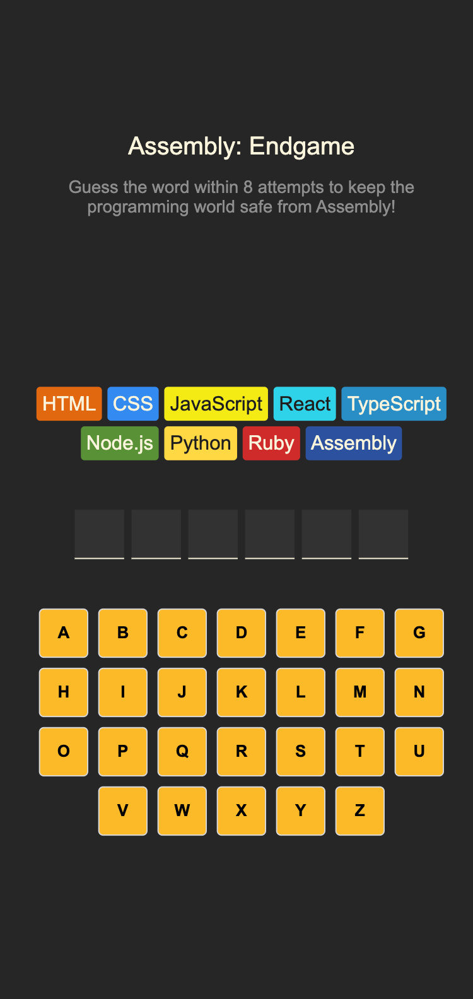
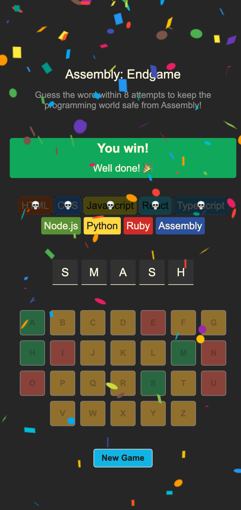
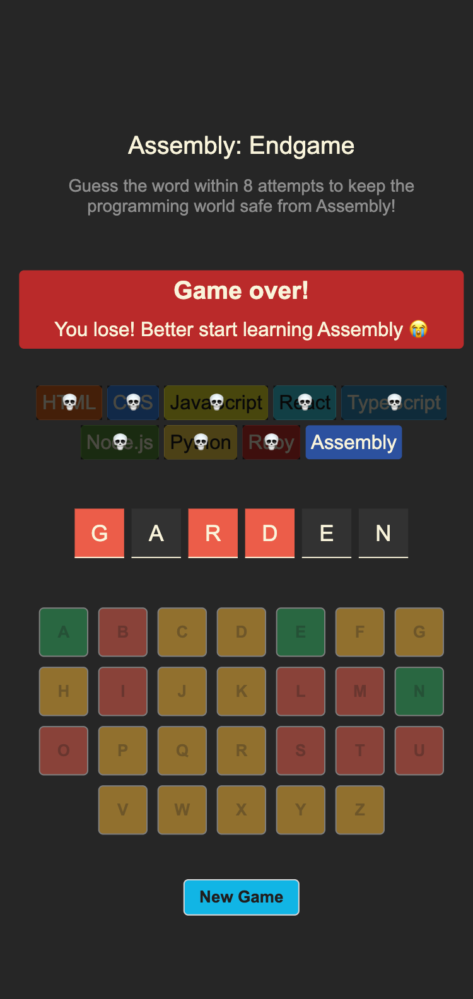

# Assembly - Endgame 🦸🏻

Unleash the superhero in you and save programming languages from extinction. <strong><a href="https://sarahhannes.github.io/assembly-endgame/"> Click here to play!</a></strong>

## Table of contents

- [Overview](#overview)
- [Screenshot](#screenshot)
- [Built with](#built-with)
- [Possible improvements](#possible-improvements)

## Overview

Users should be able to:
- Play hangman.
- See guessed letter after game is over.
- See confetti animation when game is won.

### Screenshot

|Mobile 375px|
| ---------------------------------------------- |
|        |
|      |
|        |

### Built with

- Semantic HTML5 markup
- CSS custom properties
- Flexbox
- CSS Grid
- Mobile-first workflow
- [React](https://reactjs.org/) - JS library

### Possible improvements
- Add timer
- Show remaining moves

# Credits
- The course: <a href="https://scrimba.com/learn-react-c0e">Scrimba React course</a>